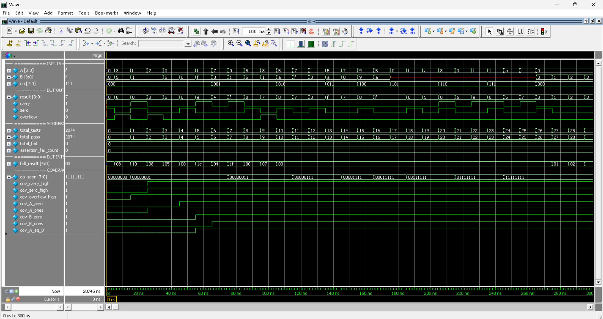

# 4-bit ALU — Design Verification Project

A beginner-to-intermediate Design Verification environment for a 4-bit Arithmetic Logic Unit, written in SystemVerilog and runnable in ModelSim/Questa.

This project demonstrates a complete non-UVM verification flow:

```text
Verification Plan
→ RTL analysis
→ Directed tests
→ Exhaustive testing
→ Independent golden model
→ Self-checking scoreboard
→ Assertion-based checking
→ Functional coverage closure
```

---

## Project Summary

| Property | Value |
|---|---|
| Design Under Test | 4-bit combinational ALU with 8 operations |
| Language | SystemVerilog, no UVM |
| Simulator | ModelSim / Questa |
| Directed vectors | 26 |
| Exhaustive vectors | 2,048 |
| Total vectors | 2,074 |
| Assertions | Immediate property checks with failure counting |
| Functional coverage | 16 manually tracked targets |
| Regression result | PASS only when scoreboard, assertions and coverage all pass |

The previous LCG-based 10,000-vector phase was replaced by exhaustive testing. Because the complete valid input space contains only 2,048 combinations, exhaustive testing is both smaller and stronger: every valid `{A, B, op}` vector is checked exactly once.

---

## Repository Structure

```text
alu-verification/
├── rtl/
│   └── alu.sv
├── tb/
│   └── alu_tb_selfcheck.sv
├── assertions/
│   └── alu_sva.sv
├── sim/
│   ├── run_sim.do
│   └── waves.do
├── docs/
│   └── verification_plan.md
├── FIXES.md
├── alu.qsf
├── alu_verification.qpf
└── README.md
```

---

## ALU Operations

| `op[2:0]` | Operation | Definition |
|---|---|---|
| `000` | ADD | `result = A + B` |
| `001` | SUB | `result = A - B` |
| `010` | AND | `result = A & B` |
| `011` | OR | `result = A \| B` |
| `100` | XOR | `result = A ^ B` |
| `101` | NOT | `result = ~A`, B ignored |
| `110` | SHL | `result = A << 1`, `carry = A[3]` |
| `111` | SHR | `result = A >> 1`, `carry = A[0]` |

Flags:

- `carry`: ADD carry-out, SUB borrow, or shifted-out bit.
- `zero`: high exactly when `result == 0`.
- `overflow`: signed two's-complement overflow for ADD and SUB only.

---

## Verification Architecture

```text
A, B, op
   ├──────────────► DUT ───────────────► actual outputs
   │                                         │
   └──────────────► reference model ─────► expected outputs
                                             │
                                  scoreboard comparison

The assertion checker monitors DUT properties in parallel.
Coverage records which operations, flags and boundary conditions were exercised.
```

### Directed Phase

The first phase contains 26 labeled tests (`DT-001` to `DT-026`). They make important behavior visible in the console and deliberately target carry, borrow, zero, signed overflow, logical identities, shifts and ignored-B behavior.

### Exhaustive Phase

The second phase runs:

```text
8 opcodes × 16 A values × 16 B values = 2,048 vectors
```

Every vector is compared with the independent reference model. The reference model detects overflow by sign-extending the operands and checking whether the mathematical result is outside the 4-bit signed range `[-8, +7]`; it does not copy the RTL's overflow equations.

### Assertions

`assertions/alu_sva.sv` checks:

- zero-flag equivalence;
- no X/Z on outputs;
- no carry or overflow for logical operations;
- AND subset and OR superset properties;
- `XOR(A,A) == 0`;
- SHL/SHR shifted-out bits and shifted-in zeros.

Assertion failures are counted and included in the final PASS/FAIL decision.

### Coverage

The testbench tracks 16 targets:

- 8 opcode targets;
- 3 flag-high targets;
- 5 operand-boundary targets.

A regression passes only when all targets are hit.

---

## How to Run

### ModelSim/Questa GUI

```tcl
cd {C:/path/to/alu-verification/sim}
do run_sim.do
```

Example:

```tcl
cd {C:/Users/Phat/OneDrive/Documents/TechProj/ALU_4bit/alu-verification/sim}
do run_sim.do
```

### Batch Mode

```bash
cd "/c/path/to/alu-verification"
vsim -c -do "cd sim; do run_sim.do; quit -f" | tee sim.log
```

The script compiles the files in this order:

```text
rtl/alu.sv
assertions/alu_sva.sv
tb/alu_tb_selfcheck.sv
```

---

## Expected Final Summary

```text
--- PHASE 1: DIRECTED TESTS ---
... 26 directed PASS lines ...
Phase 1 complete: 26 passed, 0 failed

--- PHASE 2: EXHAUSTIVE TESTS (2,048 vectors) ---
Phase 2 complete: 2074 total passed, 0 total failed

==============================================
            SIMULATION SUMMARY
==============================================
Total vectors       : 2074
Scoreboard passed   : 2074
Scoreboard failed   : 0
Assertion failures  : 0
Coverage closure    : PASS
----------------------------------------------
>>> ALL VERIFICATION CHECKS PASSED <<<
==============================================
```

A scoreboard mismatch, assertion failure, missed coverage target or timeout causes the regression to fail.

---

## Waveform Example

The waveform below shows the directed-test phase of the ALU verification environment.

It includes:
- DUT inputs `A`, `B`, and `op`
- DUT outputs `result`, `carry`, `zero`, and `overflow`
- scoreboard counters (`total_tests`, `total_pass`, `total_fail`)
- assertion failure counter
- functional coverage flags and opcode coverage tracking

This screenshot helps illustrate that the verification environment is self-checking and that coverage/status signals are updated during simulation.



## Quartus Note

`alu.qsf` is a synthesis project for the RTL top level `alu`. Testbench and assertion files are simulation-only and are compiled by `sim/run_sim.do`, not by Quartus synthesis.

---

## Files of Interest

| File | Purpose |
|---|---|
| `rtl/alu.sv` | Synthesizable ALU RTL |
| `tb/alu_tb_selfcheck.sv` | Stimulus, golden model, scoreboard and coverage |
| `assertions/alu_sva.sv` | Assertion checker |
| `docs/verification_plan.md` | Verification plan |
| `sim/run_sim.do` | ModelSim compile/run script |
| `sim/waves.do` | Waveform setup |
| `FIXES.md` | Summary of improvements applied |

---

## Author

Bui Huu Phat  
Electronics and Telecommunications, University of Science, VNU-HCM  
Focus: IC Design Verification
